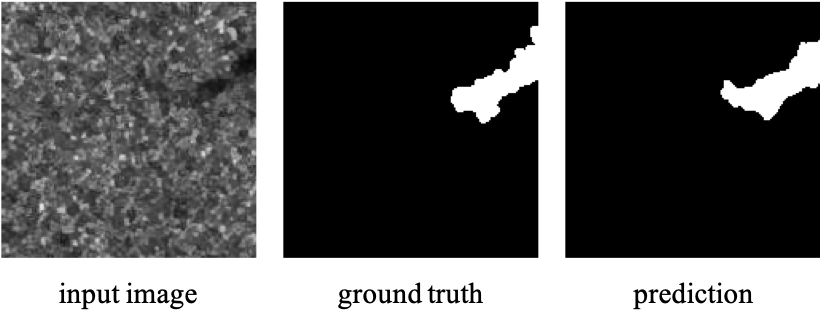

# PCA-Net: Patch-based Cross-scale Attention Network (PCA-Net) for Enhanced Ocean Oil Spill Detection in SAR Images

**We will release implementation code upon paper acceptance.**

**Target:** PCA-Net detects ocean oil spill regions in SAR images and produces detection and segmentation maps.

## Requirements
```ruby
cuda: 11.0  
python: 3.6.9  
pytorch: 1.7.0  
torchvision: 0.8.1 
```
## Installation
```ruby
git clone https://github.com/bohaoooooo/PCA-Net.git  
cd PCA-Net  
```

## Quick start
Download LEVIR-CD weight : https://drive.google.com/file/d/1Gs6iYQcZI1Jm4NhthCwWI2olbO-bpvTd/view?usp=share_link  
After downloaded the model weight, you can put it in `SARAS-Net/`.  
Then, run a demo to get started as follows:  
```ruby
python demo.py
```
After that, you can find the prediction results in `PCA-Net/ESA_SAR_output/`

<div align = center>
 
</div>


## Train
You can find `PCA-Net/cfgs/config.py` to set the training parameter.
```ruby
python train.py
```
## Test  
After training, you can put weight in `PCA-Net/`.  
Then, run a demo_oil.py to get started as follows: 
```ruby
python demo_oil.py
```

## Data structure
### Train Data Path
```ruby
ESA_SAR  
  |- train_dataset 
      |- image, gt  
  |- val_dataset  
      |- image, gt  
  |- train.txt
  |- val.txt
```
The format of `train.txt` and `val.txt` please refer to `PCA-Net/ESA_SAR/train.txt` and `PCA-Net/ESA_SAR/val.txt`   

### Test Data Path
```ruby
test_dataset  
  |- image 
      |- image
  |- label
      |- gt 
```

### Data Download
This dataset can be accessed under license from the Multimodal Data Fusion and Analytics Group at https://m4d.iti.gr/oil-spill-detection-dataset/.
   
